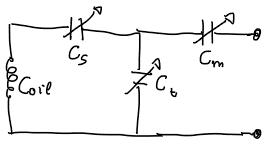

# RFAutoMaTE - Radio Frequency Automatic Matching and Tuning Equipment

Welcome to RFAutoMaTE, **R**adio **F**requency **Auto**matic **Ma**tching and **T**uning **E**quipment, our go-to solution for seamless Radio Frequency (RF) coil matching and tuning in low-field (< 100 mT) MRI scanners.

## Overview

RFAutoMaTE is designed to provide efficient and automatic matching of RF coils to ensure optimal performance and signal quality in Magnetic Resonance Imaging (MRI) systems.

## Features

- **RF Precision:** Achieve precise Radio Frequency coil matching.
- **AutoMaTE Automation:** Streamlined process with AutoMaTE (Automatic Matching and Tuning) automation.
- **Tuning Efficiency:** Efficient T (Tuning) for enhanced imaging performance.
- **Ease of Use:** E (Equipment) designed for user-friendly operation.

## Getting Started (TODO)

To get started with RFAutoMaTE, follow these simple steps:

1. **Installation:** Clone the repository to your local machine.
   ```bash
   git clone https://github.com/mriLab-i3M/RFAutoMaTE.git

2. **Configura.tion:** Adjust RFAutoMaTE settings according to your system requirements.
3. **Usage:** Integrate RFAuotMaTE into your MRI system for automatic RF coil matching and tuning.

## Testing
To test if relays are working properly, load the `test_arduino.ino` into the arduino and power the RFAutoMaTE. The relays should blink sequencitally.

If everything is ok. load the `autotunig_arduino.ino` into the arduino. Now the user can turn on/off relays by serial communication.

RFAutoMaTE is able to change the impedance by de/activating relays that chanes capacitance to a T circuit. The T circuit includes a series, tuning and matching capacitors.



Each capacitance has up to 5 capacitors, giving a total of 15 pins. An additional
digital signal (TTL) allow the user to switch the tuning matching between the
Tx/Rx switch to run MRI experiments or to the VNA to measure the coil impedance.

User can control the status by sending a set of 16 (15 capacitors + 1 switch) digits to de/activate the
capacitance.
0->Capacitor activated
1->Capacitor deactivated

Last digit correspond the switching between VNA and TxRx switch:
0->TxRx switch
1->VNA

For example, if the user wants to activate all capacitors and connect to TxRx switch:
`0000000000000000`

For the moment, the code does not check the number of digits. So make sure that
the number of digits is 16, otherwise, arduino can get frozen.

## Contributors
1. [Rubén Bosch Esteve](https://github.com/RubenBoschEsteve), circuit design and pcb design
2. [José Miguel Algarín Guisado](https://github.com/josalggui), circuit design, arduino code, integration with [MaRGE](https://github.com/josalggui/MaRGE)

## License
RFAutoMaTE is released under the GNU General Public License (GPL) v3.0.

Feel free to reach out if you have any questions or need assistance.

Happy matching and tuning!

